# IPTVPortal Client

Modern Python client for IPTVPortal JSONSQL API with full typing, async/sync support, and intuitive query building.

## Features

 - 🧬 **Schema-Aware Formatting** - CLI auto-generates or reuses table schemas to render column names in table/JSON output (disable with `--no-map-schema`)
 - 🗄️ **SQLite Sync Cache** - Local SQLite database caching with full/incremental/on-demand sync strategies for improved performance and offline capability
 - 🔄 **Smart Sync Strategies** - Choose between full table sync, incremental updates, or on-demand lazy loading based on your needs
 - 📊 **Sync Management CLI** - Complete command-line interface for cache initialization, status monitoring, and maintenance operations
 - ⚙️ **Modular Configuration** - Dynaconf-based hierarchical configuration with schema-specific overrides and environment variable support
 - 🐛 **Debug Mode** - Step-by-step logging with `--debug` flag for troubleshooting, showing SQL transpilation, JSONSQL, JSON-RPC requests, and full error tracebacks

## Installation

```bash
# Using pip
pip install iptvportal-client

# Using uv (recommended)
uv pip install iptvportal-client

# With CLI support
pip install iptvportal-client[cli]
```

## Quick Start

### CLI

```bash
# 1. Initialize configuration
iptvportal config init

# 2. Authenticate
iptvportal auth

# 3. Run queries with schema mapping (default)
iptvportal sql -q "SELECT * FROM media LIMIT 5"

# Disable schema mapping for raw field positions
iptvportal sql -q "SELECT * FROM media LIMIT 5" --no-map-schema

# Native JSONSQL
iptvportal jsonsql select --from media --limit 5
iptvportal jsonsql select --from media --limit 5 --no-map-schema
```
### Configuration

The client uses a modular configuration system powered by dynaconf and supports multiple configuration methods:

#### Quick Setup - Environment Variables (Recommended)

Set environment variables with the `IPTVPORTAL_` prefix:

```bash
export IPTVPORTAL_DOMAIN=adstat
export IPTVPORTAL_USERNAME=your_username
export IPTVPORTAL_PASSWORD=your_password

# Now run queries directly - automatically authenticated
iptvportal sql -q "SELECT * FROM tv_channel LIMIT 10"
iptvportal sql -q "SELECT COUNT(*) FROM subscriber"
```

Or use a `.env` file:

```env
IPTVPORTAL_DOMAIN=adstat
IPTVPORTAL_USERNAME=your_username
IPTVPORTAL_PASSWORD=your_password
```

The client automatically loads configuration from environment variables - no code changes needed! See [docs/ENV_VAR_AUTH.md](docs/ENV_VAR_AUTH.md) for complete details.

#### Advanced Configuration

View configuration:
```bash
# Show all settings
iptvportal config conf

# Show specific section
iptvportal config conf sync.subscriber

# Show as JSON
iptvportal config conf --format json
```

The configuration is organized hierarchically:
- **Core**: Connection, timeouts, retries
- **CLI**: Output formats, safety guardrails
- **Sync**: Cache strategies, TTLs, maintenance
- **Schema-specific**: Per-table overrides (subscriber, terminal, package)

Configuration files are automatically loaded from:
- `config/settings.yaml` - Main settings
- `config/schemas/*.settings.yaml` - Schema-specific overrides

See [docs/configuration.md](docs/configuration.md) for detailed documentation.

### Sync Client

```python
from iptvportal import IPTVPortalClient
from iptvportal.query import Field

with IPTVPortalClient() as client:
    # Using Query Builder
    query = client.query.select(
        data=["id", "name"],
        from_="tv_channel",
        limit=10
    )
    channels = client.execute(query)
    
    # Using Field API (Python-way)
    name = Field("name")
    disabled = Field("disabled")
    
    query = client.query.select(
        data=["id", "name"],
        from_="subscriber",
        where=(name.like("admin%")) & (disabled == False)
    )
    subscribers = client.execute(query)
```

### Async Client

```python
import asyncio
from iptvportal import AsyncIPTVPortalClient
from iptvportal.query import Q

async def main():
    async with AsyncIPTVPortalClient() as client:
        # Using Q Objects (Django-style)
        query = client.query.select(
            data=["id", "name"],
            from_="tv_channel",
            where=Q(name__like="%HD") & ~Q(disabled=True),
            limit=50
        )
        channels = await client.execute(query)
        
        # Parallel execution
        queries = [
            client.query.select(data=["id"], from_="subscriber"),
            client.query.select(data=["id"], from_="tv_channel"),
        ]
        results = await client.execute_many(queries)

asyncio.run(main())
```

## CLI Usage

The package includes a powerful CLI with two subapps for working with IPTVPortal API:

```bash
# Install with CLI support
pip install iptvportal-client[cli]

# Initialize configuration
iptvportal config init

# Test authentication
iptvportal auth

# Execute SQL queries (auto-transpiled to JSONSQL)
iptvportal sql -q "SELECT * FROM subscriber LIMIT 10"
iptvportal sql --edit  # Open editor for complex queries

# Execute native JSONSQL queries
iptvportal jsonsql select --from subscriber --limit 10
iptvportal jsonsql select --edit  # Editor mode

# Transpile SQL to JSONSQL (without execution)
iptvportal transpile "SELECT * FROM subscriber"
```

### CLI Commands

#### Authentication
```bash
# Check authentication status
iptvportal auth

# Force re-authentication
iptvportal auth --renew
```

#### SQL Queries (Auto-transpiled)

**Basic Queries**
```bash
# Direct SQL query
iptvportal sql -q "SELECT * FROM subscriber WHERE disabled = false LIMIT 10"

# Open editor for complex queries
iptvportal sql --edit
iptvportal sql -e

# Dry-run mode (preview transpilation without execution)
iptvportal sql -q "SELECT * FROM subscriber" --dry-run

# Show JSON-RPC request along with result
iptvportal sql -q "SELECT * FROM subscriber LIMIT 5" --show-request
```

**Aggregate Functions**
```bash
# COUNT(*) - counts all rows
iptvportal sql -q "SELECT COUNT(*) FROM tv_channel"

# COUNT(field) - counts non-null values
iptvportal sql -q "SELECT COUNT(id) FROM subscriber"

# COUNT(DISTINCT field) - counts unique values
iptvportal sql -q "SELECT COUNT(DISTINCT mac_addr) FROM terminal"

# Multiple aggregates with aliases
iptvportal sql -q "
  SELECT 
    COUNT(*) AS total, 
    COUNT(DISTINCT inet_addr) AS unique_ips 
  FROM media
"
```

**Complex JOINs**
```bash
# JOIN with EPG data
iptvportal sql -q "
  SELECT 
    c.name AS channel,
    p.title AS program,
    cat.name AS category,
    cat.genre AS genre
  FROM tv_program p
  JOIN tv_channel c ON p.channel_id = c.id
  JOIN tv_program_category pc ON pc.program_id = p.id
  JOIN tv_category cat ON pc.category_id = cat.id
  WHERE p.epg_provider_id = 36
  LIMIT 10
"
```

**DML Operations**
```bash
# INSERT with RETURNING
iptvportal sql -q "INSERT INTO package (name, paid) VALUES ('Premium', true) RETURNING id"

# UPDATE with WHERE
iptvportal sql -q "UPDATE subscriber SET disabled = true WHERE username = 'test' RETURNING id"

# DELETE
iptvportal sql -q "DELETE FROM terminal WHERE id = 123 RETURNING id"
```

**Debug Mode**
```bash
# Enable debug mode for detailed step-by-step logging
iptvportal sql -q "SELECT * FROM subscriber LIMIT 5" --debug

# Debug with JSON format (for automation)
iptvportal sql -q "SELECT * FROM subscriber" --debug --debug-format json

# Save debug logs to file
iptvportal sql -q "SELECT * FROM terminal" --debug --debug-file debug.log

# Combine with dry-run to see transpilation without execution
iptvportal sql -q "SELECT * FROM media LIMIT 10" --dry-run --debug
```

Debug mode shows:
- SQL input and transpilation steps
- Transpiled JSONSQL query
- JSON-RPC request details
- Configuration used
- Full error tracebacks

Tip: Use `--debug` when troubleshooting JOIN queries, schema mapping issues, or any errors.

#### Native JSONSQL Queries

**SELECT**
```bash
# Basic SELECT
iptvportal jsonsql select \
  --from subscriber \
  --data "id,username,disabled" \
  --limit 10

# With WHERE condition
iptvportal jsonsql select \
  --from subscriber \
  --data "id,username" \
  --where '{"eq": ["disabled", false]}' \
  --order-by username \
  --limit 10

# Editor mode
iptvportal jsonsql select --edit
```

**INSERT**
```bash
iptvportal jsonsql insert \
  --into package \
  --columns "name,paid" \
  --values '[["Premium", true]]' \
  --returning id

# Editor mode
iptvportal jsonsql insert --edit
```

**UPDATE**
```bash
iptvportal jsonsql update \
  --table subscriber \
  --set '{"disabled": true}' \
  --where '{"eq": ["username", "test"]}' \
  --returning id
```

**DELETE**
```bash
iptvportal jsonsql delete \
  --from terminal \
  --where '{"eq": ["id", 123]}' \
  --returning id
```

#### Transpile Command
```bash
# Transpile SQL to JSONSQL
iptvportal transpile "SELECT id, name FROM subscriber WHERE disabled = false"

# Output as YAML
iptvportal transpile "SELECT * FROM subscriber" --format yaml

# From file
iptvportal transpile --file query.sql
```

#### Sync Cache Commands
```bash
# Initialize cache database
iptvportal sync init

# Show cache status and registered tables
iptvportal sync status

# List all registered tables
iptvportal sync tables

# Clear cache for specific table or all tables
iptvportal sync clear subscriber
iptvportal sync clear --all

# Show detailed cache statistics
iptvportal sync stats

# Vacuum and optimize cache database
iptvportal sync vacuum
iptvportal sync vacuum --analyze
```

#### Configuration Commands
```bash
# Show current configuration
iptvportal config show

# Initialize configuration interactively
iptvportal config init

# Set specific values
iptvportal config set domain operator
iptvportal config set timeout 60

# Get specific value
iptvportal config get domain
```

#### Output Formats
```bash
# Table format (default for SELECT)
iptvportal sql -q "SELECT * FROM subscriber LIMIT 5"

# JSON format
iptvportal sql -q "SELECT * FROM subscriber LIMIT 5" --format json
iptvportal sql -q "SELECT * FROM subscriber LIMIT 5" -f json

# YAML format
iptvportal sql -q "SELECT * FROM subscriber LIMIT 5" -f yaml
```

## SQL to JSONSQL Transpiler

Convert PostgreSQL queries to JSONSQL format using the built-in transpiler:

### Python API

```python
from iptvportal.transpiler import SQLTranspiler

transpiler = SQLTranspiler(dialect='postgres')

# Simple query
result = transpiler.transpile("SELECT id, name FROM users WHERE age > 18 LIMIT 10")
# Output: {'data': ['id', 'name'], 'from': 'users', 'where': {'gt': ['age', 18]}, 'limit': 10}

# Complex query with JOINs
sql = """
    SELECT t.start, c.name 
    FROM terminal_playlog t
    JOIN tv_channel c ON c.id = t.channel_id
    WHERE t.start > '2020-02-17 00:00:00'
"""
result = transpiler.transpile(sql)
```

### Supported Features

- **SELECT statements** with columns, aliases, WHERE, GROUP BY, HAVING, ORDER BY, LIMIT, OFFSET, DISTINCT
- **JOINs** (INNER, LEFT, RIGHT, FULL, CROSS) with complex ON conditions
- **Aggregate functions** (COUNT, SUM, AVG, MIN, MAX) with DISTINCT support
  - `COUNT(*)` → `{"function": "count", "args": ["*"]}`
  - `COUNT(field)` → `{"function": "count", "args": "field"}`
  - `COUNT(DISTINCT field)` → `{"function": "count", "args": {"function": "distinct", "args": "field"}}`
- **Subqueries** in FROM, WHERE, and SELECT clauses
- **Comparison operators**: `=`, `!=`, `>`, `<`, `>=`, `<=`, `IS`, `IS NOT`
- **Logical operators**: `AND`, `OR`, `NOT`
- **Mathematical operators**: `+` (add), `-` (sub), `*` (mul), `/` (div), `%` (mod)
- **Pattern matching**: `LIKE`, `ILIKE`
- **Set operations**: `IN`, `NOT IN`
- **INSERT, UPDATE, DELETE** statements with RETURNING clause
- **Special functions**: REGEXP_REPLACE, and more

**Coverage**: ~95% of documented JSONSQL features

## Query Building

Three ways to build queries:

### 1. Classic Query Builder

```python
from iptvportal.query import QueryBuilder, Q

qb = QueryBuilder()
query = qb.select(
    data=["id", "username", "email"],
    from_="subscriber",
    where=Q.and_(
        Q.eq("disabled", False),
        Q.gte("age", 18)
    ),
    limit=100
)
```

### 2. Field API (SQLAlchemy-style)

```python
from iptvportal.query import Field, QueryBuilder

username = Field("username")
age = Field("age")
email = Field("email")

qb = QueryBuilder()
query = qb.select(
    data=["id", "username", "email"],
    from_="subscriber",
    where=(
        (username.like("admin%") | email.contains("@gmail.com")) &
        (age >= 18) &
        ~(username.in_("blocked1", "blocked2"))
    )
)
```

### 3. Q Objects (Django-style)

```python
from iptvportal.query import Q, QueryBuilder

qb = QueryBuilder()
query = qb.select(
    data=["id", "username"],
    from_="subscriber",
    where=(
        Q(username="admin") |
        (Q(age__gte=18) & Q(disabled=False))
    )
)
```

## Enhanced Error Handling

Both sync and async clients provide detailed error messages with response body information:

```python
from iptvportal import IPTVPortalClient
from iptvportal.exceptions import IPTVPortalAPIError

with IPTVPortalClient() as client:
    try:
        result = client.execute(invalid_query)
    except IPTVPortalAPIError as e:
        # Error message includes:
        # - HTTP status code
        # - Full response body (up to 500 chars)
        # - Parsed JSON error details when available
        print(f"API Error: {e}")
```

## Architecture

```
iptvportal-client/
├── src/iptvportal/
│   ├── config.py          # Pydantic Settings
│   ├── exceptions.py      # Exception hierarchy
│   ├── auth.py            # Auth managers (sync/async)
│   ├── client.py          # Sync client
│   ├── async_client.py    # Async client
│   ├── sync/
│   │   ├── __init__.py    # Sync module exports
│   │   ├── database.py    # SQLite cache database layer
│   │   ├── manager.py     # Sync orchestration and strategies
│   │   └── exceptions.py  # Sync-specific exceptions
│   ├── query/
│   │   ├── builder.py     # Query builder
│   │   ├── field.py       # Field API
│   │   └── q_objects.py   # Q Objects
│   ├── transpiler/
│   │   ├── transpiler.py  # SQL to JSONSQL transpiler
│   │   ├── operators.py   # Operator mappings
│   │   ├── functions.py   # Function handlers
│   │   └── __main__.py    # CLI interface
│   ├── schema.py          # Table schema management
│   └── cli/
│       ├── __main__.py    # CLI application
│       └── commands/
│           ├── sync.py    # Sync cache management commands
│           └── ...        # Other CLI commands
└── docs/
    ├── cli.md             # Comprehensive CLI guide
    └── jsonsql.md         # JSONSQL specification
```

## Architecture diagrams and flows

### High-level architecture


### CLI SELECT call flow

```mermaid
sequenceDiagram
  participant U as User
  participant CLI as iptvportal (Typer)
  participant TRANS as SQLTranspiler
  participant SCHEMA as schema.py
  participant CLIENT as client.py (httpx)
  participant RPC as IPTVPortal JSON-RPC

  U->>CLI: iptvportal sql -q "SELECT id, username FROM subscriber LIMIT 5"
  CLI->>TRANS: transpile(SQL, auto_order_by_id=True)
  TRANS->>SCHEMA: resolve fields, mapping, types
  SCHEMA-->>TRANS: field positions, types, order_by="id"
  TRANS-->>CLI: JSONSQL payload
  alt --dry-run
    CLI-->>U: Print JSONSQL + request (no network)
  else execute
    CLI->>CLIENT: send JSON-RPC request (w/ session header)
    CLIENT->>RPC: POST /json-rpc {method:"select", params:{...}}
    RPC-->>CLIENT: rows (positional arrays)
    CLIENT->>SCHEMA: map positions → named fields
    SCHEMA-->>CLIENT: mapped rows
    CLIENT-->>CLI: result set
    CLI-->>U: formatted output
  end
```



### Sync/cache dataflow


### Auth/session lifecycle


### Example ER diagram (examples/full-schema-example.yaml)


## Documentation

- **[Authentication Guide](docs/authentication.md)** - Complete guide to authentication setup and usage
- **[CLI Documentation](docs/cli.md)** - Complete guide to CLI usage with examples
- **[Configuration Guide](docs/configuration.md)** - Detailed configuration options and settings
- **[JSONSQL Specification](docs/jsonsql.md)** - IPTVPortal JSONSQL API reference
- **[Project Structure](docs/PROJECT_STRUCTURE.md)** - Annotated tree view of the codebase

### Project Structure Documentation

Generate annotated tree structure of the project:

```bash
# Quick view (max depth 3)
make docs-tree

# Full tree structure
make docs-tree-full

# Save to file
make docs-tree-file
```

Or use the script directly:

```bash
python scripts/generate_tree_docs.py src/iptvportal --max-depth 3
```

See [scripts/README.md](scripts/README.md) for more details.

## Development

### Quick Start

```bash
# Clone repository
git clone https://github.com/pv-udpv/iptvportal-client.git
cd iptvportal-client

# Install with uv (recommended)
make dev

# Or manually
uv venv
source .venv/bin/activate  # Windows: .venv\Scripts\activate
uv pip install -e ".[dev]"

# Run tests
make test

# Run all checks
make ci
```

### Contributing

We welcome contributions! Please see [CONTRIBUTING.md](.github/CONTRIBUTING.md) for detailed guidelines on:

- Setting up your development environment
- Code style and testing requirements
- Submitting pull requests
- Working with GitHub Copilot

### Security

For security vulnerabilities, please see our [Security Policy](.github/SECURITY.md) for responsible disclosure guidelines.

### GitHub Copilot Instructions

This repository includes GitHub Copilot instructions in `.github/copilot-instructions.md` that enforce:
- **Documentation consistency checks** - Copilot verifies that changes to code are reflected in documentation
- **Automatic doc updates** - When core functionality changes, Copilot suggests corresponding documentation updates
- **CLI reference accuracy** - Ensures CLI examples in README.md match the actual command structure

When contributing, Copilot will help maintain sync between code and documentation automatically.

## License

MIT License - see LICENSE file for details.
