# IPTVPortal Client

Modern Python client for IPTVPortal JSONSQL API with full typing, async/sync support, and intuitive query building.

## Features

 - 🧬 **Schema-Aware Formatting** - CLI auto-generates or reuses table schemas to render column names in table/JSON output (disable with `--no-map-schema`)
 - 🗄️ **SQLite Sync Cache** - Local SQLite database caching with full/incremental/on-demand sync strategies for improved performance and offline capability
 - 🔄 **Smart Sync Strategies** - Choose between full table sync, incremental updates, or on-demand lazy loading based on your needs
 - 📊 **Sync Management CLI** - Complete command-line interface for cache initialization, status monitoring, and maintenance operations
 - ⚙️ **Modular Configuration** - Dynaconf-based hierarchical configuration with schema-specific overrides and environment variable support
 - 🐛 **Debug Mode** - Step-by-step logging with `--debug` flag for troubleshooting, showing SQL transpilation, JSONSQL, JSON-RPC requests, and full error tracebacks
 - 🤖 **Pydantic Model Generator** - Automated generation of type-safe Pydantic models from table schemas with validators, Google-style docstrings, and mypy strict compliance

## Installation

```bash
# Using pip
pip install iptvportal-client

# Using uv (recommended)
uv pip install iptvportal-client

# With CLI support
pip install iptvportal-client[cli]
```

## Quick Start

### CLI

```bash
# 1. Initialize configuration
iptvportal config init

# 2. Authenticate
iptvportal jsonsql auth

# 3. Run queries with schema mapping (default)
iptvportal jsonsql sql -q "SELECT * FROM media LIMIT 5"

# Disable schema mapping for raw field positions
iptvportal jsonsql sql -q "SELECT * FROM media LIMIT 5" --no-map-schema

# Native JSONSQL
iptvportal jsonsql select --from media --limit 5
iptvportal jsonsql select --from media --limit 5 --no-map-schema

# Schema management
iptvportal schema list
iptvportal schema show media
iptvportal schema introspect subscriber

# Cache management
iptvportal cache status
iptvportal cache clear

# Utilities
iptvportal jsonsql utils transpile "SELECT * FROM subscriber"
iptvportal jsonsql utils validate '{"from": "subscriber", "data": ["*"]}'
```
### Configuration

The client uses a modular configuration system powered by dynaconf and supports multiple configuration methods:

#### Quick Setup - Environment Variables (Recommended)

Set environment variables with the `IPTVPORTAL_` prefix:

```bash
export IPTVPORTAL_DOMAIN=adstat
export IPTVPORTAL_USERNAME=your_username
export IPTVPORTAL_PASSWORD=your_password

# Now run queries directly - automatically authenticated
iptvportal jsonsql sql -q "SELECT * FROM tv_channel LIMIT 10"
iptvportal jsonsql sql -q "SELECT COUNT(*) FROM subscriber"
```

Or use a `.env` file:

```env
IPTVPORTAL_DOMAIN=adstat
IPTVPORTAL_USERNAME=your_username
IPTVPORTAL_PASSWORD=your_password
```

The client automatically loads configuration from environment variables - no code changes needed! See [docs/ENV_VAR_AUTH.md](docs/ENV_VAR_AUTH.md) for complete details.

#### Advanced Configuration

View configuration:
```bash
# Show all settings
iptvportal config show

# Show specific section
iptvportal config show sync.subscriber

# Show as JSON
iptvportal config show --format json
```

The configuration is organized hierarchically:
- **Core**: Connection, timeouts, retries
- **CLI**: Output formats, safety guardrails
- **Sync**: Cache strategies, TTLs, maintenance
- **Schema-specific**: Per-table overrides (subscriber, terminal, package)

Configuration files are automatically loaded from:
- `config/settings.yaml` - Main settings
- `config/schemas/*.settings.yaml` - Schema-specific overrides

See [docs/configuration.md](docs/configuration.md) for detailed documentation.

### Sync Client

```python
from iptvportal import IPTVPortalClient, Field

with IPTVPortalClient() as client:
    # Using Query Builder
    query = client.query.select(
        data=["id", "name"],
        from_="tv_channel",
        limit=10
    )
    channels = client.execute(query)
    
    # Using Field API (Python-way)
    name = Field("name")
    disabled = Field("disabled")
    
    query = client.query.select(
        data=["id", "name"],
        from_="subscriber",
        where=(name.like("admin%")) & (disabled == False)
    )
    subscribers = client.execute(query)
```

### Async Client

```python
import asyncio
from iptvportal import AsyncIPTVPortalClient, Q

async def main():
    async with AsyncIPTVPortalClient() as client:
        # Using Q Objects (Django-style)
        query = client.query.select(
            data=["id", "name"],
            from_="tv_channel",
            where=Q(name__like="%HD") & ~Q(disabled=True),
            limit=50
        )
        channels = await client.execute(query)
        
        # Parallel execution
        queries = [
            client.query.select(data=["id"], from_="subscriber"),
            client.query.select(data=["id"], from_="tv_channel"),
        ]
        results = await client.execute_many(queries)

asyncio.run(main())
```

## CLI Usage

The package includes a powerful service-oriented CLI with auto-discovery of service modules:

```bash
# Install with CLI support
pip install iptvportal-client[cli]

# Initialize configuration
iptvportal config init

# Test authentication
iptvportal jsonsql auth

# Execute SQL queries (auto-transpiled to JSONSQL)
iptvportal jsonsql sql -q "SELECT * FROM subscriber LIMIT 10"
iptvportal jsonsql sql --edit  # Open editor for complex queries

# Execute native JSONSQL queries
iptvportal jsonsql select --from subscriber --limit 10
iptvportal jsonsql select --edit  # Editor mode

# Transpile SQL to JSONSQL (without execution)
iptvportal jsonsql transpile "SELECT * FROM subscriber"
# View available services
iptvportal --help

# Service structure:
# - config: Global configuration management
# - cache: Query result cache management
# - schema: Table schema management
# - jsonsql: API operations (auth, SQL, JSONSQL, utilities)
# - sync: SQLite sync cache management
```

### CLI Commands

#### Authentication
```bash
# Check authentication status
iptvportal jsonsql auth

# Force re-authentication
iptvportal jsonsql auth --renew
```

#### SQL Queries (Auto-transpiled)

**Basic Queries**
```bash
# Direct SQL query
iptvportal jsonsql sql -q "SELECT * FROM subscriber WHERE disabled = false LIMIT 10"

# Open editor for complex queries
iptvportal jsonsql sql --edit
iptvportal jsonsql sql -e

# Dry-run mode (preview transpilation without execution)
iptvportal jsonsql sql -q "SELECT * FROM subscriber" --dry-run

# Show JSON-RPC request along with result
iptvportal jsonsql sql -q "SELECT * FROM subscriber LIMIT 5" --show-request
```

**Aggregate Functions**
```bash
# COUNT(*) - counts all rows
iptvportal jsonsql sql -q "SELECT COUNT(*) FROM tv_channel"

# COUNT(field) - counts non-null values
iptvportal jsonsql sql -q "SELECT COUNT(id) FROM subscriber"

# COUNT(DISTINCT field) - counts unique values
iptvportal jsonsql sql -q "SELECT COUNT(DISTINCT mac_addr) FROM terminal"

# Multiple aggregates with aliases
iptvportal jsonsql sql -q "
  SELECT 
    COUNT(*) AS total, 
    COUNT(DISTINCT inet_addr) AS unique_ips 
  FROM media
"
```

**Complex JOINs**
```bash
# JOIN with EPG data
iptvportal jsonsql sql -q "
  SELECT 
    c.name AS channel,
    p.title AS program,
    cat.name AS category,
    cat.genre AS genre
  FROM tv_program p
  JOIN tv_channel c ON p.channel_id = c.id
  JOIN tv_program_category pc ON pc.program_id = p.id
  JOIN tv_category cat ON pc.category_id = cat.id
  WHERE p.epg_provider_id = 36
  LIMIT 10
"
```

**DML Operations**
```bash
# INSERT with RETURNING
iptvportal jsonsql sql -q "INSERT INTO package (name, paid) VALUES ('Premium', true) RETURNING id"

# UPDATE with WHERE
iptvportal jsonsql sql -q "UPDATE subscriber SET disabled = true WHERE username = 'test' RETURNING id"

# DELETE
iptvportal jsonsql sql -q "DELETE FROM terminal WHERE id = 123 RETURNING id"
```

**Debug Mode**
```bash
# Enable debug mode for detailed step-by-step logging
iptvportal jsonsql sql -q "SELECT * FROM subscriber LIMIT 5" --debug

# Debug with JSON format (for automation)
iptvportal jsonsql sql -q "SELECT * FROM subscriber" --debug --debug-format json

# Save debug logs to file
iptvportal jsonsql sql -q "SELECT * FROM terminal" --debug --debug-file debug.log

# Combine with dry-run to see transpilation without execution
iptvportal jsonsql sql -q "SELECT * FROM media LIMIT 10" --dry-run --debug
```

Debug mode shows:
- SQL input and transpilation steps
- Transpiled JSONSQL query
- JSON-RPC request details
- Configuration used
- Full error tracebacks

Tip: Use `--debug` when troubleshooting JOIN queries, schema mapping issues, or any errors.

#### Native JSONSQL Queries

**SELECT**
```bash
# Basic SELECT
iptvportal jsonsql select \
  --from subscriber \
  --data "id,username,disabled" \
  --limit 10

# With WHERE condition
iptvportal jsonsql select \
  --from subscriber \
  --data "id,username" \
  --where '{"eq": ["disabled", false]}' \
  --order-by username \
  --limit 10

# Editor mode
iptvportal jsonsql select --edit
```

**INSERT**
```bash
iptvportal jsonsql insert \
  --into package \
  --columns "name,paid" \
  --values '[["Premium", true]]' \
  --returning id

# Editor mode
iptvportal jsonsql insert --edit
```

**UPDATE**
```bash
iptvportal jsonsql update \
  --table subscriber \
  --set '{"disabled": true}' \
  --where '{"eq": ["username", "test"]}' \
  --returning id
```

**DELETE**
```bash
iptvportal jsonsql delete \
  --from terminal \
  --where '{"eq": ["id", 123]}' \
  --returning id
```

#### Transpile and Utility Commands
```bash
# Transpile SQL to JSONSQL
iptvportal jsonsql transpile "SELECT id, name FROM subscriber WHERE disabled = false"

# Output as YAML
iptvportal jsonsql transpile "SELECT * FROM subscriber" --format yaml

# From file
iptvportal jsonsql transpile --file query.sql
iptvportal jsonsql utils transpile "SELECT id, name FROM subscriber WHERE disabled = false"

# Output as YAML
iptvportal jsonsql utils transpile "SELECT * FROM subscriber" --format yaml

# From file
iptvportal jsonsql utils transpile --file query.sql

# Validate JSONSQL syntax
iptvportal jsonsql utils validate '{"from": "subscriber", "data": ["*"]}'

# Pretty-print JSONSQL
iptvportal jsonsql utils format '{"from":"subscriber","data":["*"]}'
```

#### Schema Management Commands
```bash
# List all loaded schemas or show specific schema
iptvportal jsonsql schema show                    # list all
iptvportal jsonsql schema show tv_channel         # show specific table

# Introspect table structure with metadata and statistics
iptvportal jsonsql schema introspect tv_channel

# Introspect with sync to local cache
iptvportal jsonsql schema introspect tv_channel --sync

# Introspect, sync, and analyze from cache (more comprehensive)
iptvportal jsonsql schema introspect media --sync --analyze-from-cache

# With custom field mappings and sync options
iptvportal jsonsql schema introspect tv_program \
  --fields='0:channel_id,1:start,2:stop' \
  --sync \
  --sync-chunk=5000 \
  --order-by-fields='id:asc'

# Save introspection results to schema file
iptvportal jsonsql schema introspect tv_channel --sync --save
```

**What Schema Introspection Provides:**
- Automatic field detection (names and types)
- Row counts, ID ranges, timestamp ranges
- DuckDB statistical analysis (nulls, unique values, cardinality, min/max, etc.)
- Smart sync configuration recommendations
- Optional sync to local cache for offline access
- Comprehensive analysis on synced data (not just samples)

#### Sync Cache Commands
```bash
# Initialize cache database
iptvportal sync init

# Show cache status and registered tables
iptvportal sync status

# List all registered tables
iptvportal sync tables

# Clear cache for specific table or all tables
iptvportal sync clear subscriber
iptvportal sync clear --all

# Show detailed cache statistics
iptvportal sync stats

# Vacuum and optimize cache database
iptvportal sync vacuum
iptvportal sync vacuum --analyze
```

#### Configuration Commands
```bash
# Global configuration management
iptvportal config show
iptvportal config init
iptvportal config set domain operator
iptvportal config get domain

# Advanced configuration (dynaconf integration)
iptvportal config conf                    # Show all settings
iptvportal config conf sync.subscriber    # Show specific section
iptvportal config conf --format json      # Output as JSON

# Service-specific configuration
iptvportal cache config show              # Cache settings
iptvportal cache config get ttl           # Get cache TTL
iptvportal schema config show             # Schema settings
iptvportal jsonsql config show            # API settings
```

#### Service-Oriented CLI Architecture

The CLI uses a service-oriented architecture with auto-discovery:

**Available Services:**
- **config**: Global configuration management
- **cache**: Query result cache management (status, clear, config)
- **schema**: Table schema management (list, show, introspect, config)
- **jsonsql**: API operations (auth, sql, select/insert/update/delete, utils, config)
- **sync**: SQLite sync cache management (init, register, run, status)

**Hierarchical Configuration:**
Each service has its own `config` subcommand for service-specific settings:
```bash
iptvportal cache config show      # Cache-specific config
iptvportal schema config show     # Schema-specific config
iptvportal jsonsql config show    # JSONSQL/API config
```

Configuration precedence (highest to lowest):
1. Runtime flags: `--timeout 60`
2. Service config: `iptvportal cache config set timeout 60`
3. Global config: `iptvportal config set timeout 30`
4. Defaults from settings.yaml

#### Output Formats
```bash
# Table format (default for SELECT)
iptvportal jsonsql sql -q "SELECT * FROM subscriber LIMIT 5"

# JSON format
iptvportal jsonsql sql -q "SELECT * FROM subscriber LIMIT 5" --format json
iptvportal jsonsql sql -q "SELECT * FROM subscriber LIMIT 5" -f json

# YAML format
iptvportal jsonsql sql -q "SELECT * FROM subscriber LIMIT 5" -f yaml
```

## SQL to JSONSQL Transpiler

Convert PostgreSQL queries to JSONSQL format using the built-in transpiler:

### Python API

```python
from iptvportal import SQLTranspiler

transpiler = SQLTranspiler(dialect='postgres')

# Simple query
result = transpiler.transpile("SELECT id, name FROM users WHERE age > 18 LIMIT 10")
# Output: {'data': ['id', 'name'], 'from': 'users', 'where': {'gt': ['age', 18]}, 'limit': 10}

# Complex query with JOINs
sql = """
    SELECT t.start, c.name 
    FROM terminal_playlog t
    JOIN tv_channel c ON c.id = t.channel_id
    WHERE t.start > '2020-02-17 00:00:00'
"""
result = transpiler.transpile(sql)
```

### Supported Features

- **SELECT statements** with columns, aliases, WHERE, GROUP BY, HAVING, ORDER BY, LIMIT, OFFSET, DISTINCT
- **JOINs** (INNER, LEFT, RIGHT, FULL, CROSS) with complex ON conditions
- **Aggregate functions** (COUNT, SUM, AVG, MIN, MAX) with DISTINCT support
  - `COUNT(*)` → `{"function": "count", "args": ["*"]}`
  - `COUNT(field)` → `{"function": "count", "args": "field"}`
  - `COUNT(DISTINCT field)` → `{"function": "count", "args": {"function": "distinct", "args": "field"}}`
- **Subqueries** in FROM, WHERE, and SELECT clauses
- **Comparison operators**: `=`, `!=`, `>`, `<`, `>=`, `<=`, `IS`, `IS NOT`
- **Logical operators**: `AND`, `OR`, `NOT`
- **Mathematical operators**: `+` (add), `-` (sub), `*` (mul), `/` (div), `%` (mod)
- **Pattern matching**: `LIKE`, `ILIKE`
- **Set operations**: `IN`, `NOT IN`
- **INSERT, UPDATE, DELETE** statements with RETURNING clause
- **Special functions**: REGEXP_REPLACE, and more

**Coverage**: ~95% of documented JSONSQL features

## Query Building

Three ways to build queries:

### 1. Classic Query Builder

```python
from iptvportal import QueryBuilder, Q

qb = QueryBuilder()
query = qb.select(
    data=["id", "username", "email"],
    from_="subscriber",
    where=Q.and_(
        Q.eq("disabled", False),
        Q.gte("age", 18)
    ),
    limit=100
)
```

### 2. Field API (SQLAlchemy-style)

```python
from iptvportal import Field, QueryBuilder

username = Field("username")
age = Field("age")
email = Field("email")

qb = QueryBuilder()
query = qb.select(
    data=["id", "username", "email"],
    from_="subscriber",
    where=(
        (username.like("admin%") | email.contains("@gmail.com")) &
        (age >= 18) &
        ~(username.in_("blocked1", "blocked2"))
    )
)
```

### 3. Q Objects (Django-style)

```python
from iptvportal import Q, QueryBuilder

qb = QueryBuilder()
query = qb.select(
    data=["id", "username"],
    from_="subscriber",
    where=(
        Q(username="admin") |
        (Q(age__gte=18) & Q(disabled=False))
    )
)
```

---

## Pydantic Model Generator

The IPTVPortal client includes an advanced Pydantic model generator that automatically creates type-safe models from table schemas with full validation, documentation, and integration support.

### Features

- **Automated Type Inference** - Converts FieldType enums to Python types (INTEGER → int, STRING → str, etc.)
- **Modern Type Syntax** - Uses Python 3.10+ union syntax (`str | None` instead of `Optional[str]`)
- **Field Validation** - Generates validators for string trimming, numeric constraints, etc.
- **Google-Style Docstrings** - Complete documentation with examples
- **mypy Strict Compliance** - All generated code passes `mypy --strict`
- **Integration Checking** - Validates compatibility with transport layer and resource managers

### MCP Tools

Three Model Context Protocol (MCP) tools are provided for model generation workflow:

1. **pydantic_schema** - Generate Pydantic models from schemas
2. **schema_validator** - Validate generated models (AST, docstrings, mypy)
3. **integration_checker** - Check transport/resource manager compatibility

### Usage Example

```python
from iptvportal.schema import (
    PydanticModelGenerator,
    SchemaBuilder,
    SchemaRegistry,
    FieldType,
)

# Create a schema
registry = SchemaRegistry()
subscriber_schema = (
    SchemaBuilder("subscriber")
    .field(0, "id", field_type=FieldType.INTEGER, description="Subscriber ID")
    .field(1, "username", field_type=FieldType.STRING, description="Username")
    .field(2, "email", field_type=FieldType.STRING, description="Email")
    .set_total_fields(3)
    .build()
)

# Add constraints
subscriber_schema.fields[0].constraints = {"nullable": False, "ge": 1}
subscriber_schema.fields[1].constraints = {"nullable": False, "min_length": 3}
subscriber_schema.fields[2].constraints = {"nullable": True}

registry.register(subscriber_schema)

# Generate model
generator = PydanticModelGenerator(registry)
model_code = generator.generate_model("subscriber", include_validators=True)
print(model_code)

# Validate the generated model
validation_report = generator.validate_model(model_code)
print(f"Valid: {validation_report['valid']}")

# Check integration
integration_report = generator.check_integration(model_code, "subscriber")
print(f"Transport compatible: {integration_report['transport_compatible']}")
```

### Generated Model Example

The generator produces complete, production-ready Pydantic models:

```python
from __future__ import annotations

from pydantic import BaseModel, Field, field_validator, ConfigDict


class Subscriber(BaseModel):
    """Subscriber model.
    
    Represents a subscriber record from the IPTVPortal database.
    
    Attributes:
        id: Subscriber ID
        username: Username  
        email: Email
    """
    
    id: int = Field(..., ge=1, description="Subscriber ID")
    username: str = Field(..., min_length=3, description="Username")
    email: str | None = Field(None, description="Email")
    
    @field_validator('username')
    @classmethod
    def validate_username(cls, v: str) -> str:
        if not v or not v.strip():
            raise ValueError("username cannot be empty")
        return v.strip()
    
    model_config = ConfigDict(
        from_attributes=True,
        str_strip_whitespace=True,
        validate_assignment=True,
    )
```

For more details, see:
- Full example: `examples/pydantic_generator_example.py`
- Agent specification: `.github/agents/pydantic-agent.md`
- API documentation: `src/iptvportal/schema/pydantic_generator.py`

---

## Enhanced Error Handling

Both sync and async clients provide detailed error messages with response body information:

```python
from iptvportal import IPTVPortalClient
from iptvportal.exceptions import IPTVPortalAPIError

with IPTVPortalClient() as client:
    try:
        result = client.execute(invalid_query)
    except IPTVPortalAPIError as e:
        # Error message includes:
        # - HTTP status code
        # - Full response body (up to 500 chars)
        # - Parsed JSON error details when available
        print(f"API Error: {e}")
```

## Architecture

The package follows a **layered architecture** with clear separation of concerns:

```
┌─────────────────────────────────────────┐
│   CLI / API (Interface Layer)           │  ← Thin presentation layer
└────────────────┬────────────────────────┘
                 ↓
┌─────────────────────────────────────────┐
│   Services (Business Logic)             │  ← QueryService, AuthService, etc.
└────────────────┬────────────────────────┘
                 ↓
┌─────────────────────────────────────────┐
│   Core (Infrastructure)                 │  ← Client, HTTP, Cache, Schema
└─────────────────────────────────────────┘
```

### Package Structure

```
iptvportal-client/
├── src/iptvportal/
│   ├── core/              # Infrastructure layer
│   │   ├── client.py          # Sync IPTVPortal client
│   │   ├── async_client.py    # Async IPTVPortal client
│   │   ├── auth.py            # Auth managers (sync/async)
│   │   └── cache.py           # Query result cache
│   ├── config/            # Configuration management
│   │   ├── settings.py        # Pydantic Settings
│   │   ├── project.py         # Dynaconf configuration
│   │   └── logging.py         # Logging configuration
│   ├── cache/             # Cache service (query result caching)
│   │   └── __cli__.py         # Cache CLI commands
│   ├── schema/            # Schema system
│   │   ├── table.py           # TableSchema, FieldDefinition, SchemaRegistry, SchemaLoader
│   │   ├── introspector.py    # Schema introspection
│   │   ├── duckdb_analyzer.py # DuckDB-based statistical analysis
│   │   └── codegen.py         # ORM model generation
│   ├── jsonsql/           # JSONSQL transpiler & query builder
│   │   ├── transpiler.py      # SQL → JSONSQL transpiler
│   │   ├── builder.py         # Query builder DSL
│   │   ├── operators.py       # Operator mappings
│   │   ├── functions.py       # Function handlers
│   │   └── exceptions.py      # Transpiler exceptions
│   ├── models/            # Data Transfer Objects (DTOs)
│   │   ├── requests.py        # Input validation models
│   │   └── responses.py       # Output models with metadata
│   ├── service/           # Business logic layer
│   │   └── query.py           # QueryService (orchestration)
│   ├── sync/              # SQLite sync system
│   │   ├── database.py        # SQLite cache database
│   │   ├── manager.py         # Sync orchestration
│   │   └── exceptions.py      # Sync-specific exceptions
│   ├── cli/               # Command-line interface
│   │   ├── __main__.py        # CLI application entry
│   │   └── commands/          # CLI command modules
│   ├── exceptions.py      # Exception hierarchy
│   ├── validation.py      # Pandas-based validation
│   ├── logging_setup.py   # Logging configuration and setup
│   └── project_conf.py    # Legacy project configuration (backward compatibility)
└── docs/
    ├── cli.md             # Comprehensive CLI guide
    └── jsonsql.md         # JSONSQL specification
```

### Using the Service Layer (New API)

```python
from iptvportal import (
    IPTVPortalClient,
    IPTVPortalSettings,
    QueryService,
    SQLQueryInput,
)

# Setup
settings = IPTVPortalSettings()
client = IPTVPortalClient(settings)
service = QueryService(client)

with client:
    # Execute SQL with full orchestration
    query_input = SQLQueryInput(
        sql="SELECT * FROM subscriber LIMIT 10",
        use_schema_mapping=True,
        use_cache=True,
    )
    result = service.execute_sql(query_input)
    
    print(f"Rows: {result.row_count}")
    print(f"Time: {result.execution_time_ms:.2f}ms")
    print(f"Data: {result.data}")
```

See `examples/service_layer_example.py` for more details.

### Direct Client API (Still Supported)

```python
from iptvportal import IPTVPortalClient

with IPTVPortalClient() as client:
    # Using Query Builder
    query = client.query.select(
        data=["id", "username"],
        from_="subscriber",
        limit=10
    )
    result = client.execute(query)
```

## Architecture diagrams and flows

### High-level architecture


### CLI SELECT call flow

```mermaid
sequenceDiagram
  participant U as User
  participant CLI as iptvportal (Typer)
  participant TRANS as SQLTranspiler
  participant SCHEMA as schema/ (table.py)
  participant CLIENT as client.py (httpx)
  participant RPC as IPTVPortal JSON-RPC

  U->>CLI: iptvportal jsonsql sql -q "SELECT id, username FROM subscriber LIMIT 5"
  CLI->>TRANS: transpile(SQL, auto_order_by_id=True)
  TRANS->>SCHEMA: resolve fields, mapping, types
  SCHEMA-->>TRANS: field positions, types, order_by="id"
  TRANS-->>CLI: JSONSQL payload
  alt --dry-run
    CLI-->>U: Print JSONSQL + request (no network)
  else execute
    CLI->>CLIENT: send JSON-RPC request (w/ session header)
    CLIENT->>RPC: POST /json-rpc {method:"select", params:{...}}
    RPC-->>CLIENT: rows (positional arrays)
    CLIENT->>SCHEMA: map positions → named fields
    SCHEMA-->>CLIENT: mapped rows
    CLIENT-->>CLI: result set
    CLI-->>U: formatted output
  end
```



### Sync/cache dataflow


### Auth/session lifecycle


### Example ER diagram (examples/full-schema-example.yaml)


## Documentation

- **[Authentication Guide](docs/authentication.md)** - Complete guide to authentication setup and usage
- **[CLI Documentation](docs/cli.md)** - Complete guide to CLI usage with examples
- **[Configuration Guide](docs/configuration.md)** - Detailed configuration options and settings
- **[JSONSQL Specification](docs/jsonsql.md)** - IPTVPortal JSONSQL API reference
- **[Project Structure](docs/PROJECT_STRUCTURE.md)** - Annotated tree view of the codebase

### Project Structure Documentation

Generate annotated tree structure of the project:

```bash
# Quick view (max depth 3)
make docs-tree

# Full tree structure
make docs-tree-full

# Save to file
make docs-tree-file
```

Or use the script directly:

```bash
python scripts/generate_tree_docs.py src/iptvportal --max-depth 3
```

See [scripts/README.md](scripts/README.md) for more details.

## Development

### Quick Start

```bash
# Clone repository
git clone https://github.com/pv-udpv/iptvportal-client.git
cd iptvportal-client

# Install with uv (recommended)
make dev

# Or manually
uv venv
source .venv/bin/activate  # Windows: .venv\Scripts\activate
uv pip install -e ".[dev]"

# For container environments (GitHub Actions, Docker) where uv is unavailable
python3 -m pip install -e ".[dev]"

# Run tests
make test

# Run all checks
make ci
```

### Contributing

We welcome contributions! Please see [CONTRIBUTING.md](.github/CONTRIBUTING.md) for detailed guidelines on:

- Setting up your development environment
- Code style and testing requirements
- Submitting pull requests
- Working with GitHub Copilot and specialized agents

### GitHub Copilot Agents

This project uses specialized GitHub Copilot agents to automate development workflows:

- **7 specialized agents** for different tasks (API integration, testing, CLI, documentation, etc.)
- **Orchestrator agent** coordinates complex features across multiple agents
- **Automated scaffolding** for resource managers, CLI commands, and tests
- **Quality enforcement** through built-in validation and checks

See [.github/agents/README.md](.github/agents/README.md) for complete documentation on using agents to accelerate development while maintaining code quality.

### Security

For security vulnerabilities, please see our [Security Policy](.github/SECURITY.md) for responsible disclosure guidelines.

### GitHub Copilot Instructions

This repository includes GitHub Copilot instructions in `.github/copilot-instructions.md` that enforce:
- **Documentation consistency checks** - Copilot verifies that changes to code are reflected in documentation
- **Automatic doc updates** - When core functionality changes, Copilot suggests corresponding documentation updates
- **CLI reference accuracy** - Ensures CLI examples in README.md match the actual command structure

When contributing, Copilot will help maintain sync between code and documentation automatically.

## Troubleshooting

### Common Issues

#### Authentication Errors

**Problem**: `AuthenticationError: Invalid credentials`

**Solution**:
```bash
# Verify environment variables are set
echo $IPTVPORTAL_DOMAIN
echo $IPTVPORTAL_USERNAME

# Force re-authentication
iptvportal jsonsql auth --renew

# Check configuration
iptvportal config show
```

#### Connection Timeouts

**Problem**: `TimeoutError: Request timeout`

**Solution**:
```bash
# Increase timeout in configuration
export IPTVPORTAL_TIMEOUT=60

# Or in cli-config.yaml:
# core:
#   timeout: 60
```

#### Schema Mapping Issues

**Problem**: Column names showing as `field_0`, `field_1` instead of actual names

**Solution**:
```bash
# Generate or update schema
iptvportal schema introspect table_name

# Verify schema exists
iptvportal schema show table_name

# Check schema directory configuration
iptvportal config show cli.schema_directory
```

#### Cache Issues

**Problem**: Stale data or inconsistent results

**Solution**:
```bash
# Clear all cache
iptvportal cache clear

# Clear specific table cache (if using table-aware caching)
iptvportal cache clear --table subscriber

# Check cache status
iptvportal cache status
```

#### Installation Problems

**Problem**: Package installation fails

**Solution**:
```bash
# Use pip with longer timeout
pip install --default-timeout=300 iptvportal-client

# Or install from source
git clone https://github.com/pv-udpv/iptvportal-client.git
cd iptvportal-client
pip install -e .
```

#### Import Errors

**Problem**: `ModuleNotFoundError: No module named 'iptvportal'`

**Solution**:
```bash
# Ensure package is installed
pip list | grep iptvportal

# Reinstall in development mode
pip install -e .

# Check Python path
python -c "import sys; print('\n'.join(sys.path))"
```

### Debug Mode

Enable debug mode for detailed logging:

```bash
# With SQL queries
iptvportal jsonsql sql -q "SELECT * FROM subscriber LIMIT 5" --debug

# With JSON format for automation
iptvportal jsonsql sql -q "SELECT * FROM terminal" --debug --debug-format json

# Save debug logs to file
iptvportal jsonsql sql -q "SELECT * FROM media" --debug --debug-file debug.log
```

### Getting Help

- **Documentation**: Check the [docs/](docs/) directory
- **Issues**: Search existing [GitHub Issues](https://github.com/pv-udpv/iptvportal-client/issues)
- **Discussions**: Start a [GitHub Discussion](https://github.com/pv-udpv/iptvportal-client/discussions)
- **Contributing**: See [CONTRIBUTING.md](CONTRIBUTING.md)

### Reporting Bugs

When reporting bugs, please include:

1. IPTVPortal Client version: `pip show iptvportal-client`
2. Python version: `python --version`
3. Operating system
4. Full error message and stack trace
5. Steps to reproduce
6. Configuration (redact sensitive information)

See our [Bug Report Template](.github/ISSUE_TEMPLATE/bug_report.md) for details.

## License

MIT License - see LICENSE file for details.
