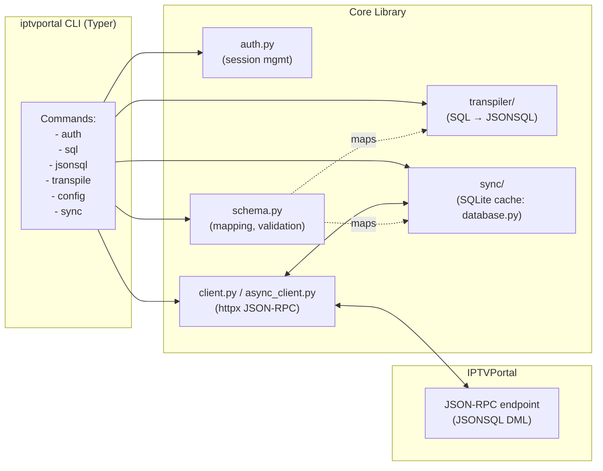
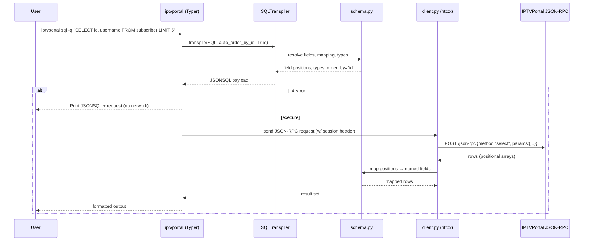
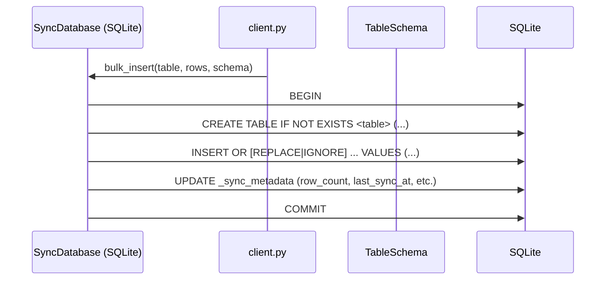
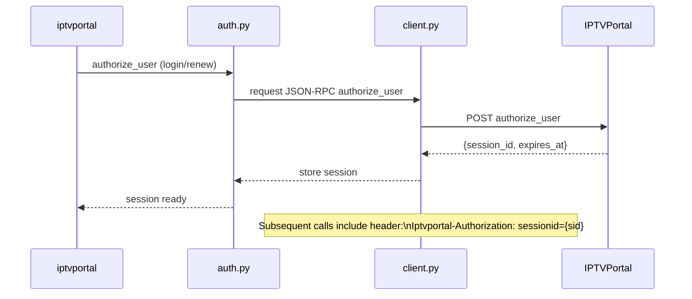
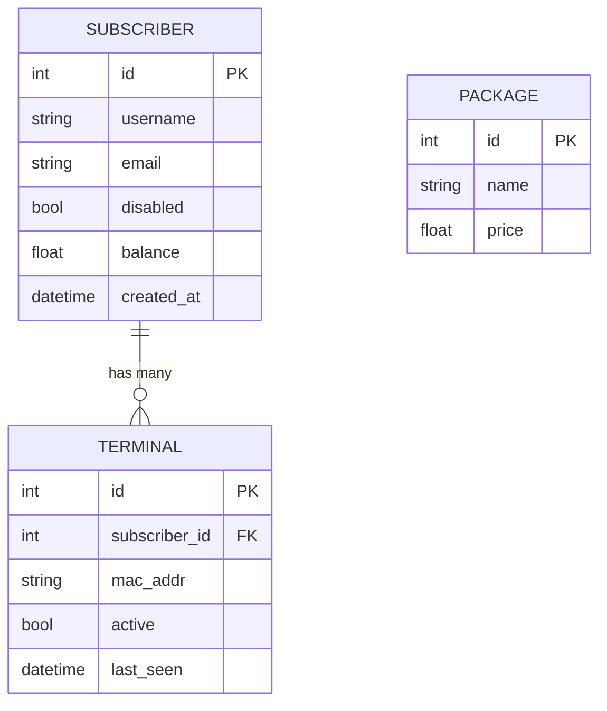

# Architecture and Data Flows

This document consolidates the diagrams that appear in the root `README.md` with a bit more detail for future maintainers. All diagrams use Mermaid and render natively on GitHub.

## High-level architecture

## CLI SELECT call flow

## Sync/cache dataflow

## Auth/session lifecycle

## ER diagram (examples schema)

## Notes for maintainers

- Keep diagrams aligned with CLI surface in `docs/cli.md` and schema rules in `docs/schema-driven.md`.
- When changing schema mapping behavior or transpiler output shapes, update both the sequence diagrams and the ER diagram samples.
- If sync metadata tables or views change, update the dataflow diagram and list of metadata objects.
