# Architecture and Data Flows

This document consolidates the diagrams that appear in the root `README.md` with comprehensive system architecture details for future maintainers, contributors, and reverse engineers. All diagrams use Mermaid and render natively on GitHub.

## Table of Contents

1. [System Architecture Overview](#system-architecture-overview)
2. [Proxy-Centric Architecture](#proxy-centric-architecture)
3. [Multi-Level Caching Strategy](#multi-level-caching-strategy)
4. [Schema-Driven Architecture](#schema-driven-architecture)
5. [Sequence Diagrams](#sequence-diagrams)
   - [Query Execution Flow](#query-execution-flow)
   - [Cache Sync Lifecycle](#cache-sync-lifecycle)
   - [Authentication Lifecycle](#authentication-lifecycle)
6. [High-Level Component Architecture](#high-level-component-architecture)
7. [Architecture Narrative](#architecture-narrative)

---

## System Architecture Overview

The iptvportal-client is built on a **proxy-centric, schema-driven, highly cache-optimized, and configuration-driven architecture**. This section provides a complete system view showing all layers, entities, and their relationships.

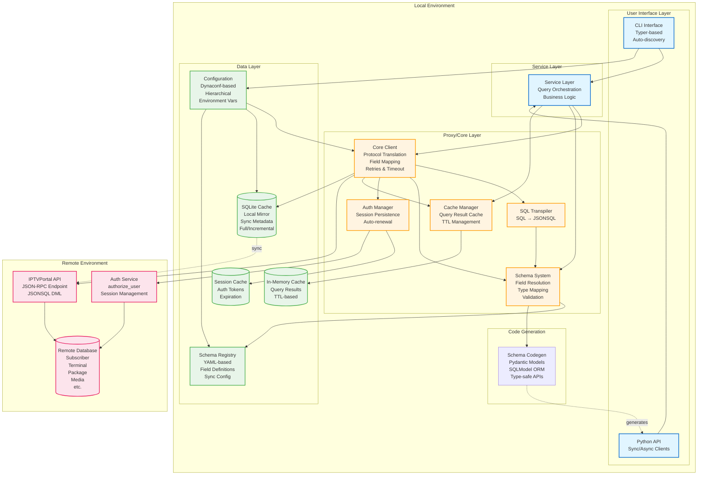

### Layer Responsibilities

#### User Interface Layer
- **CLI**: Service-oriented CLI with auto-discovery, rich formatting, debug mode, dry-run capabilities
- **Python API**: Sync and async client APIs with query builder, Field API, Q objects

#### Service Layer
- Orchestrates query execution with business logic
- Coordinates between proxy, schema system, and cache layers
- Provides high-level abstractions for common operations

#### Proxy/Core Layer (Central Hub)
The proxy layer is the heart of the architecture, managing:
- **Protocol Translation**: SQL → JSONSQL transpilation
- **Field Mapping**: Position-based to named field translation using schema system
- **Schema Resolution**: Field type inference, validation, and transformation
- **Cache Coordination**: Multi-level cache strategy (in-memory, SQLite, remote)
- **Authentication**: Session lifecycle, token persistence, auto-renewal
- **Retries & Resilience**: Automatic retry logic, timeout management, error handling
- **Configuration Injection**: Hierarchical config resolution and application

#### Data Layer
- **Configuration**: Dynaconf-based hierarchical configuration with environment variable support
- **Schema Registry**: YAML-based schema definitions with field mappings and sync configuration
- **SQLite Cache**: Local mirror of remote tables with sync metadata
- **Session Cache**: Persistent authentication token storage
- **In-Memory Cache**: Fast query result caching with TTL

#### Code Generation
- Generates type-safe Pydantic models and SQLModel ORM classes from schemas
- Enables compile-time type checking and IDE autocomplete
- Includes validators, relationships, and constraints

---

## Proxy-Centric Architecture

The proxy layer acts as an intelligent intermediary between local and remote systems, providing abstraction, optimization, and resilience.

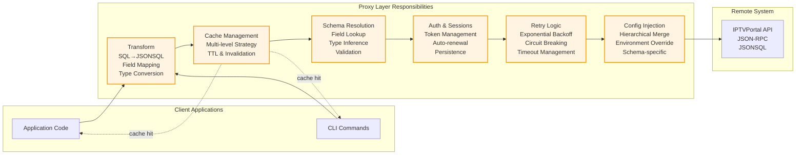

### Proxy Layer Features

1. **Transparent Protocol Translation**
   - Accepts SQL queries or native JSONSQL
   - Automatic transpilation with schema-aware optimization
   - Preserves semantic equivalence

2. **Intelligent Caching**
   - Three-tier strategy: in-memory → SQLite → remote
   - Automatic cache population and invalidation
   - Configurable TTL per table

3. **Schema-Driven Operations**
   - Field position resolution using schema registry
   - Automatic type conversion and validation
   - Support for SELECT * expansion

4. **Resilient Communication**
   - Automatic retry with exponential backoff
   - Configurable timeout and retry limits
   - Detailed error context and logging

5. **Configuration-Driven Behavior**
   - Hierarchical configuration (global → service → table)
   - Environment variable overrides
   - Runtime configuration inspection

---

## Multi-Level Caching Strategy

The client implements a sophisticated three-tier caching strategy for optimal performance and offline capability.

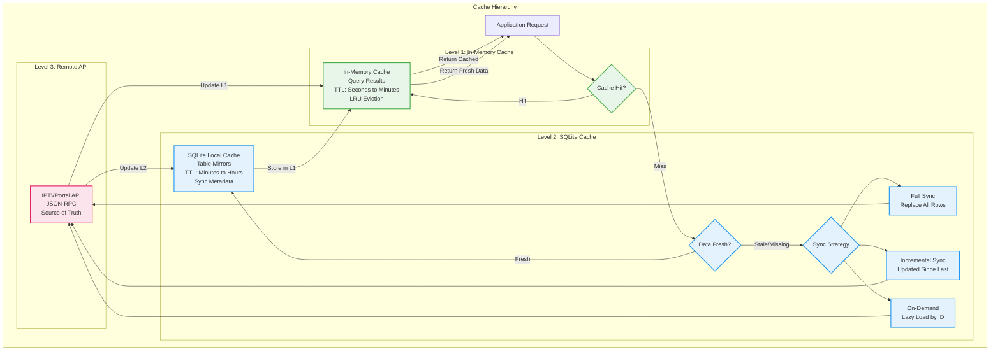

### Cache Level Details

#### Level 1: In-Memory Cache
- **Purpose**: Ultra-fast repeated query results
- **Storage**: Python dict/LRU cache
- **TTL**: Configurable (default: 5-60 seconds)
- **Scope**: Per-process, lost on restart
- **Best for**: High-frequency reads, dashboard data

#### Level 2: SQLite Cache
- **Purpose**: Persistent local mirror with rich query capabilities
- **Storage**: SQLite database (~/.iptvportal/cache.db)
- **TTL**: Configurable per table (default: 15-60 minutes)
- **Sync Strategies**:
  - **Full Sync**: Complete table replacement (for small/volatile tables)
  - **Incremental**: Updates based on `updated_at` field (for large tables)
  - **On-Demand**: Lazy load individual records (for sparse access patterns)
- **Features**: 
  - Full SQL query support (JOINs, aggregates, CTEs)
  - Sync metadata tracking (last_sync, row_count)
  - Offline query capability
- **Best for**: Complex queries, offline operations, JOIN-heavy workloads

#### Level 3: Remote API
- **Purpose**: Authoritative data source
- **Protocol**: JSON-RPC over HTTPS
- **Authentication**: Session-based with auto-renewal
- **Rate Limiting**: Configurable request throttling
- **Best for**: Write operations, real-time data, cache misses

### Cache Invalidation
- **Time-based**: Automatic expiration via TTL
- **Manual**: `iptvportal cache clear` command
- **Event-based**: Invalidate on write operations
- **Partial**: Table-level or query-pattern-based invalidation

---

## Schema-Driven Architecture

Schemas are the foundation of the entire system, driving code generation, validation, caching, and API interactions.

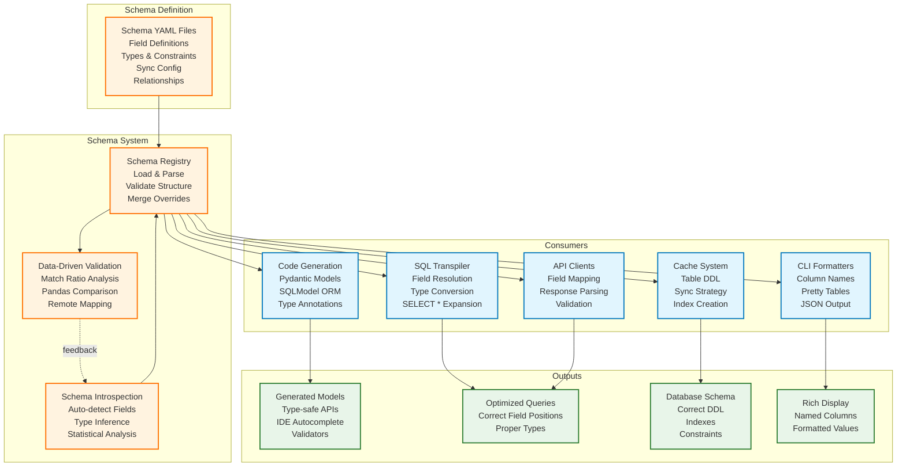

### Schema Workflow

1. **Definition**
   - Manual YAML authoring with field definitions
   - Or automatic introspection from remote tables
   - Includes field positions, types, constraints, relationships

2. **Validation**
   - Data-driven validation using pandas
   - Compares local schema with remote data samples
   - Produces match ratio metrics and type analysis

3. **Registration**
   - Loaded into schema registry at startup
   - Merged with configuration overrides
   - Available to all system components

4. **Code Generation**
   - Generates Pydantic/SQLModel classes
   - Includes validators, relationships, docstrings
   - Enables type-safe development

5. **Runtime Usage**
   - Field position → name mapping
   - Type conversion and validation
   - Query optimization (auto ORDER BY id)
   - SELECT * expansion to specific fields

### Schema Benefits

- **Type Safety**: Compile-time type checking via generated models
- **Consistency**: Single source of truth for field definitions
- **Automation**: Auto-generates boilerplate code
- **Validation**: Data-driven correctness verification
- **Documentation**: Self-documenting schemas with descriptions
- **Flexibility**: Override configurations per table/environment

---

## Sequence Diagrams

### Query Execution Flow

Complete flow from SQL query to formatted results, showing all layers and caching.

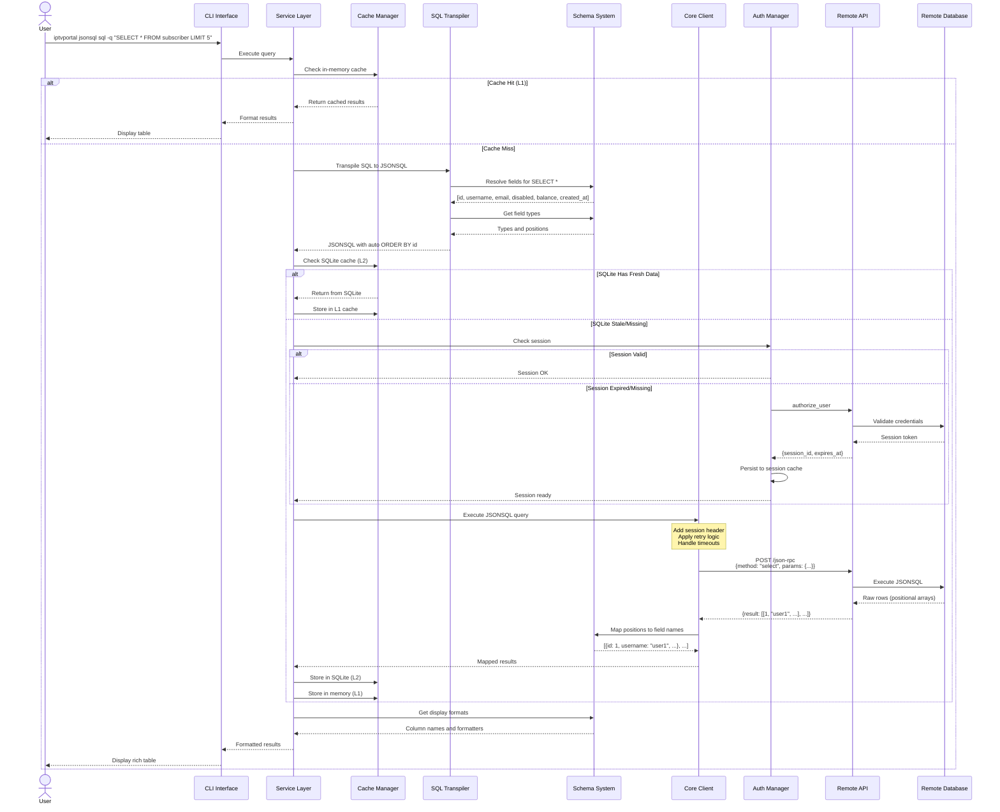

### Cache Sync Lifecycle

Detailed sync workflow for SQLite cache with full/incremental strategies.

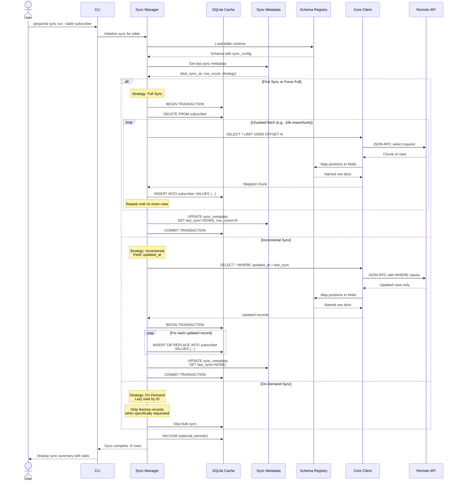

### Authentication Lifecycle

Session management with auto-renewal and persistence.

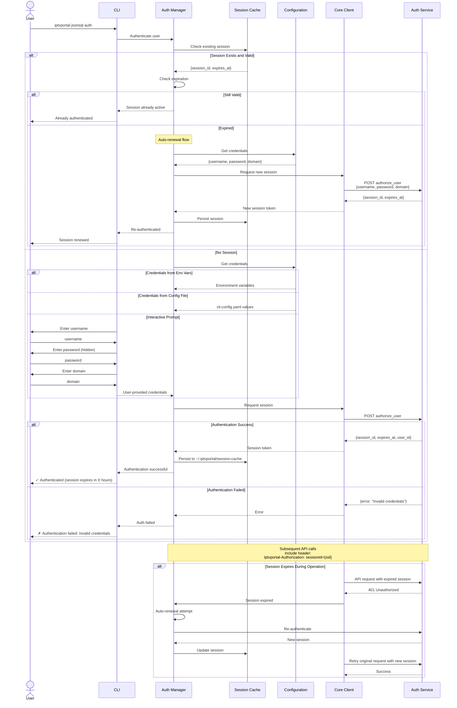

---

## High-Level Component Architecture

This is the original high-level architecture diagram, now in context with the detailed system views above.

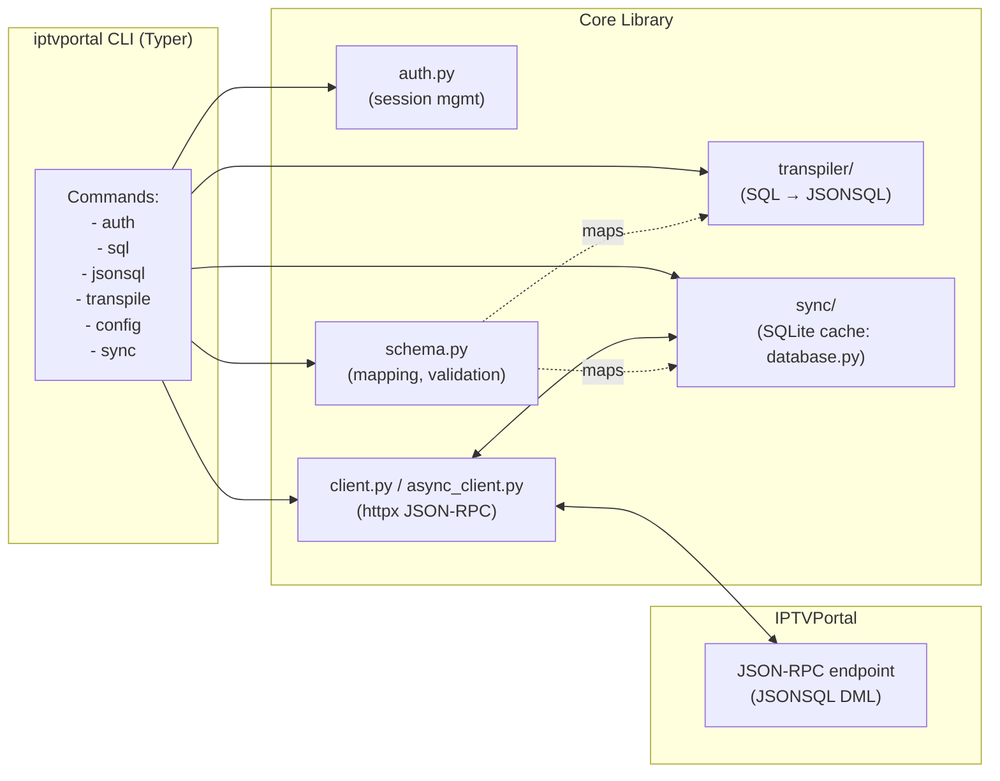

## CLI SELECT call flow

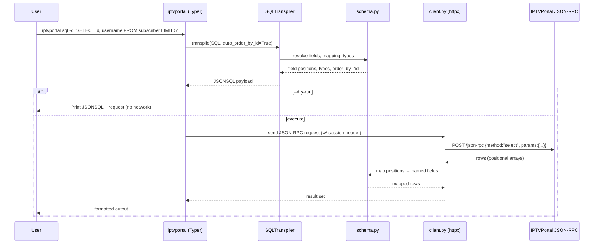

## Sync/cache dataflow

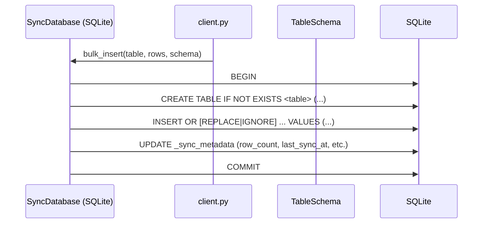

## Auth/session lifecycle

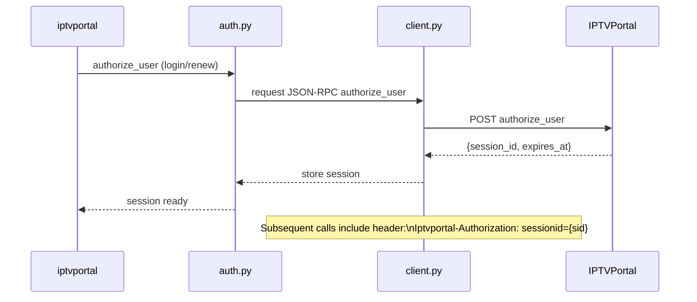

## ER diagram (examples schema)

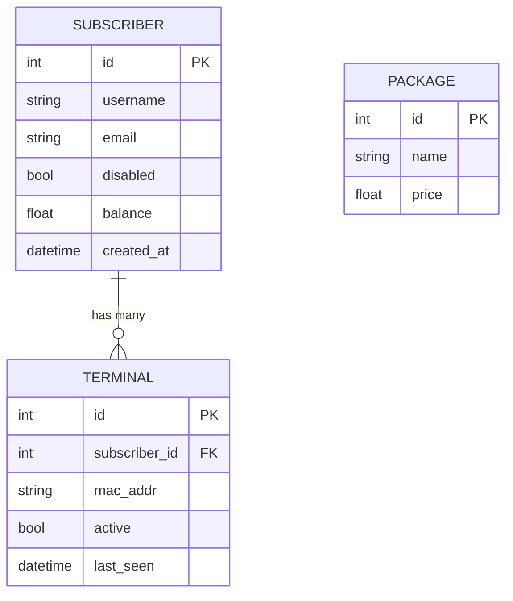

---

## Architecture Narrative

### Design Philosophy

The iptvportal-client is designed around three core principles:

1. **Proxy-Centric Design**: A smart intermediary layer that abstracts complexity, provides caching, and ensures resilient communication
2. **Schema-Driven Everything**: Single source of truth for field definitions that drives code generation, validation, and runtime behavior
3. **Configuration Over Convention**: Hierarchical, environment-aware configuration that adapts to different deployment scenarios

### The Proxy Layer: Heart of the Architecture

The proxy/core layer is the central nervous system of the application. It sits between user-facing interfaces (CLI, Python API) and the remote IPTVPortal API, providing:

**Protocol Translation**: Users can write SQL queries, which are automatically transpiled to JSONSQL. The transpiler is schema-aware, performing SELECT * expansion, auto-adding ORDER BY id for consistency, and ensuring field positions match the schema registry.

**Multi-Level Caching**: Three caching tiers work together:
- **In-memory**: Ultra-fast repeated queries (seconds-level TTL)
- **SQLite**: Persistent local mirror with full SQL capabilities (minutes-level TTL)
- **Remote API**: Source of truth accessed only on cache misses

This design provides:
- Sub-millisecond query response for cached data
- Offline query capability via SQLite
- Reduced load on remote API
- Rich local query support (JOINs, aggregates) impossible in JSONSQL

**Schema Resolution**: Every query passes through the schema system, which:
- Maps field positions to human-readable names
- Applies type conversions (e.g., string to datetime)
- Validates field access
- Enables SELECT * by expanding to actual field list

**Resilience**: The proxy implements retry logic with exponential backoff, timeout management, and detailed error context. Transient failures are automatically recovered.

**Authentication**: Session management is transparent - tokens are cached, auto-renewed before expiration, and re-established on failure. Users authenticate once; the system handles the rest.

### Schema-Driven Architecture

Schemas are not just metadata - they are executable specifications that drive the entire system:

**Code Generation**: From a single YAML schema, the system generates:
- Pydantic models for validation
- SQLModel ORM classes for database access
- Type annotations for IDE autocomplete
- Docstrings for documentation

**Runtime Behavior**: Schemas control:
- How queries are transpiled (field positions, types)
- How results are formatted (column names, pretty-printing)
- How data is cached (table DDL, indexes, sync strategies)
- How validation occurs (type checking, constraint enforcement)

**Data-Driven Validation**: The system can validate schemas against live data:
- Fetch sample rows from remote API
- Compare local field definitions with actual data
- Calculate match ratios using pandas
- Identify type mismatches and missing fields

This approach ensures schemas stay accurate as the remote API evolves.

### Configuration-Driven Behavior

Configuration is hierarchical and composable:

```
Global defaults (config/settings.yaml)
  ↓
Service-level overrides (cache, schema, sync)
  ↓
Table-specific overrides (subscriber, terminal, etc.)
  ↓
Environment variables (IPTVPORTAL_*)
  ↓
Runtime flags (--timeout, --no-cache)
```

Each level can override the previous, enabling:
- **Development**: Quick config changes via environment variables
- **Production**: Locked-down configuration files
- **Testing**: Override everything via runtime flags
- **Multi-tenant**: Different configs per table/service

### Service-Oriented CLI

The CLI uses automatic service discovery:
- Each package with `__cli__.py` becomes a CLI service
- Services can have nested subcommands
- Configuration is hierarchical (global and per-service)
- No manual registration needed - just create the file

This design enables:
- Independent service development
- Consistent command structure
- Easy extension without modifying core code
- Self-documenting help text

### Sync System: Local Mirror Strategy

The SQLite sync system is designed for:
- **Performance**: Local JOINs and aggregates impossible in JSONSQL
- **Offline**: Continue working when API is unavailable
- **Efficiency**: Three sync strategies (full, incremental, on-demand) optimize for different table characteristics

Sync strategies are configurable per table:
- **Full Sync**: Small or frequently-changing tables (e.g., active sessions)
- **Incremental**: Large tables with `updated_at` field (e.g., subscribers)
- **On-Demand**: Sparse access patterns (e.g., lookup by specific ID)

Metadata tracking enables smart sync:
- Last sync timestamp
- Row counts (detect deletions)
- Sync duration (performance monitoring)
- Schema hash (detect schema changes)

### Error Handling Philosophy

Errors are handled at multiple levels:

1. **Client Level**: Network errors, timeouts, rate limiting
2. **Proxy Level**: Session expiration, auth failures, retry exhaustion
3. **Schema Level**: Field resolution errors, type mismatches
4. **Service Level**: Business logic errors, validation failures

Each level provides context for the next, building detailed error messages that help users diagnose issues.

### Performance Characteristics

The architecture is designed for performance:

- **In-memory cache**: < 1ms query time
- **SQLite cache**: 1-10ms for complex queries with JOINs
- **Remote API**: 100-500ms (network + database)

Cache hit rates typically exceed 90% for read-heavy workloads, providing 100x+ speedup.

### Extension Points

The architecture is designed for extension:

1. **Custom Transformers**: Add field transformers in schema system
2. **New Services**: Create `__cli__.py` in any package
3. **Cache Strategies**: Implement new sync strategies in sync manager
4. **Query Builders**: Extend Field API with custom operators
5. **Formatters**: Add new output formats in CLI formatters

### Trade-offs and Limitations

**Complexity vs. Capability**: The multi-layer architecture adds complexity but provides powerful capabilities (caching, offline, type safety) that justify the cost.

**Memory Usage**: In-memory caching trades memory for speed. Configurable TTL and LRU eviction prevent unbounded growth.

**Sync Latency**: SQLite cache may serve stale data between syncs. TTL configuration balances freshness vs. performance.

**Schema Maintenance**: Schemas must be kept in sync with remote API. Introspection and validation tools minimize manual effort.

### Future Evolution

The architecture supports future enhancements:

- **Distributed Caching**: Redis/Memcached for shared cache across processes
- **Change Streams**: Real-time sync using database change feeds
- **GraphQL Layer**: Alternative query interface over JSONSQL
- **Smart Prefetching**: ML-based prediction of needed data
- **Multi-Master Sync**: Bidirectional sync with conflict resolution

---

## Notes for Maintainers

### Documentation Alignment

- Keep diagrams aligned with CLI surface in `docs/cli.md` and schema rules in `docs/schema-driven.md`.
- When changing schema mapping behavior or transpiler output shapes, update both the sequence diagrams and the ER diagram samples.
- If sync metadata tables or views change, update the dataflow diagram and list of metadata objects.
- Update architecture narrative when adding new layers, components, or design patterns.

### Diagram Maintenance

- All diagrams use Mermaid and must render correctly on GitHub.
- Test diagrams in GitHub's markdown preview or Mermaid Live Editor.
- Use consistent styling (colors, line styles) across related diagrams.
- Keep diagram complexity manageable - split into multiple diagrams if needed.

### Architecture Evolution

When making architectural changes:

1. **Document First**: Update this document before implementing major changes
2. **Diagram Impact**: Identify which diagrams need updates
3. **Backward Compatibility**: Document breaking changes clearly
4. **Migration Path**: Provide upgrade guidance for users
5. **Performance Impact**: Measure before/after performance characteristics

### Component Boundaries

Respect these architectural boundaries:

- **CLI ↔ Service Layer**: CLI only calls service layer, never client directly
- **Service ↔ Proxy**: Service orchestrates, proxy executes
- **Proxy ↔ Schema**: All field resolution goes through schema system
- **Proxy ↔ Cache**: All caching goes through cache manager
- **Proxy ↔ Remote**: All remote calls go through proxy with auth/retry

### Testing Strategy

Test at appropriate architectural levels:

- **Unit Tests**: Individual components (transpiler, schema system, cache manager)
- **Integration Tests**: Layer interactions (proxy + schema, service + cache)
- **End-to-End Tests**: Full flow (CLI command → remote API → formatted output)
- **Performance Tests**: Cache hit rates, query latency, sync duration

### Security Considerations

- Never log session tokens or credentials
- Session cache must have restricted permissions (600)
- Configuration files may contain secrets - exclude from version control
- Validate all inputs at service layer before passing to proxy
- Use parameterized queries in SQLite to prevent injection

### Performance Monitoring

Key metrics to track:

- Cache hit rates (L1, L2)
- Average query latency (cached vs. uncached)
- Sync duration and row counts
- Session renewal frequency
- Retry rates and timeout frequency

### Common Pitfalls

1. **Bypassing Proxy**: Don't call remote API directly - always go through proxy
2. **Ignoring Schema**: Don't hardcode field positions - use schema resolution
3. **Cache Coherence**: Remember SQLite cache may be stale - sync strategy matters
4. **Session Management**: Let auth manager handle sessions - don't manage manually
5. **Configuration Override**: Respect hierarchy - higher levels override lower

### Debugging Tips

- Enable debug mode: `iptvportal --debug ...`
- Use dry-run mode: `iptvportal jsonsql sql -q "..." --dry-run`
- Check cache status: `iptvportal cache status`
- Inspect sync metadata: `iptvportal sync status --table X`
- View configuration: `iptvportal config show`
- Test schema validation: `iptvportal schema validate-mapping X ...`

### Related Documentation

- [CLI Architecture](cli-architecture.md) - Service-oriented CLI design
- [SQLite Proxy Architecture](sqlite-proxy-architecture.md) - Detailed proxy layer design
- [Schema-Driven Development](schema-driven.md) - Schema system deep dive
- [Configuration Guide](configuration.md) - Hierarchical configuration details
- [Sync Workflow](sync-workflow.md) - Sync strategies and best practices
