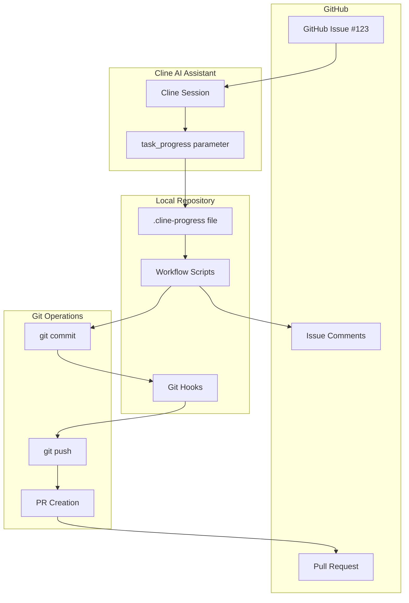
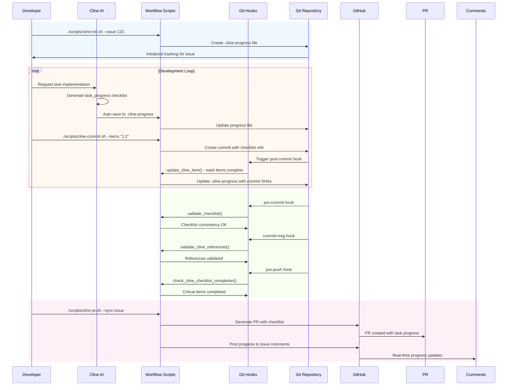
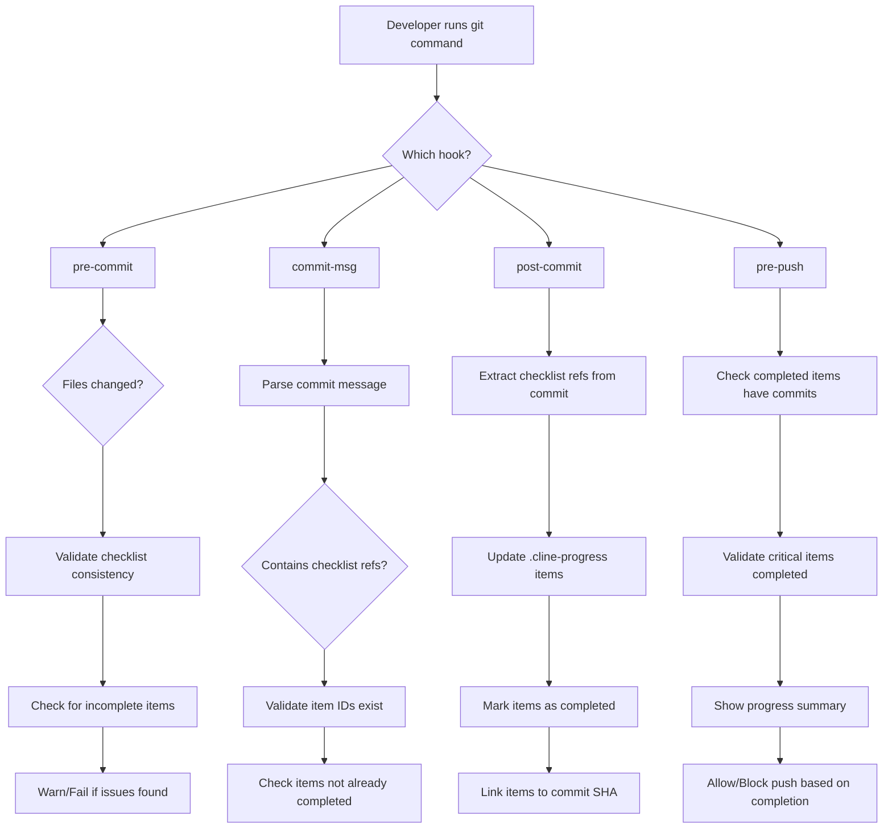
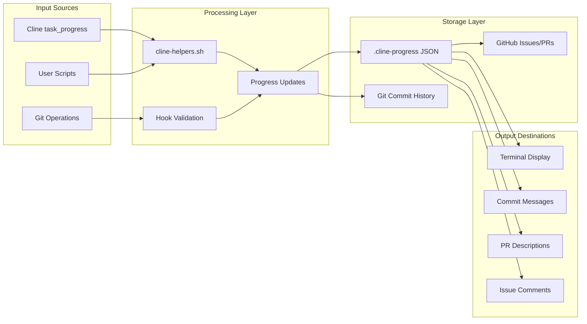
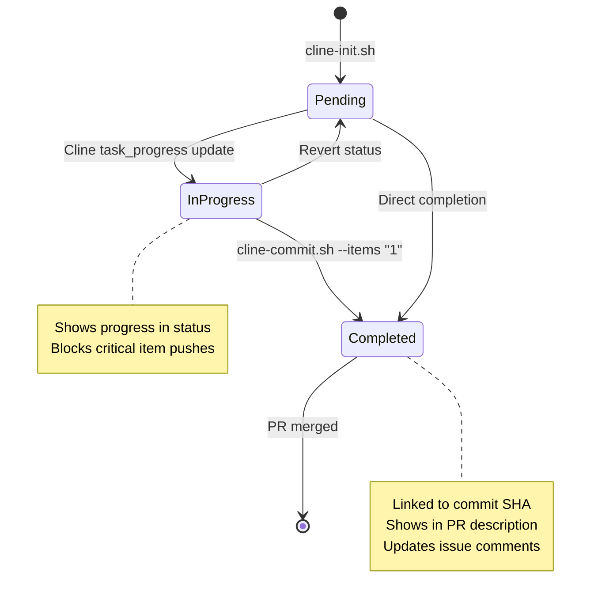
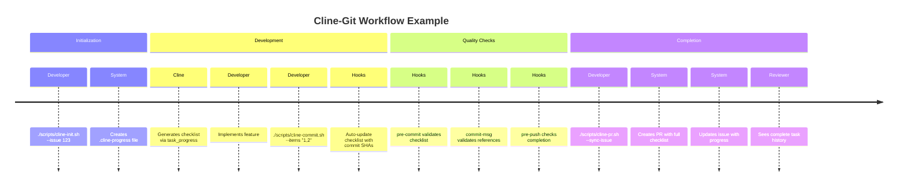
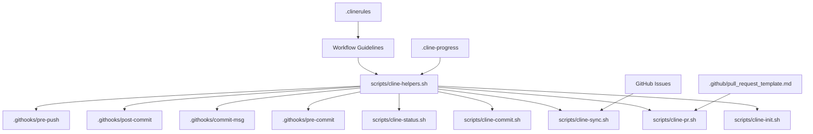

# Cline Workflow Integration

## Overview

This document describes the comprehensive integration between Cline AI assistant and the IPTVPortal git workflow, enabling continuous checklist tracking merged with commit IDs and GitHub issues.

## System Architecture

## Detailed Workflow Process

## Hook Integration Flow

## Data Flow Architecture

## Checklist Item Lifecycle

## Integration Points Summary

| Component | Integration Method | Purpose |
|-----------|-------------------|---------|
| **Cline AI** | `task_progress` parameter | Generate/update checklists |
| **Git Hooks** | Source `cline-helpers.sh` | Automatic validation/updates |
| **User Scripts** | Call helper functions | Interactive workflow |
| **Commit Messages** | `Completes: #X` format | Link items to commits |
| **PR Template** | Auto-generated checklist | Show progress in reviews |
| **GitHub Issues** | Comment updates | Real-time progress tracking |

## Example Complete Workflow

## Key Benefits

- **Continuous Tracking**: Checklist persists across Cline sessions
- **Automatic Linking**: Commits automatically linked to checklist items
- **Quality Gates**: Git hooks enforce checklist discipline
- **Real-time Sync**: Progress updates flow to GitHub automatically
- **Audit Trail**: Complete history in git commits and PR descriptions
- **Team Visibility**: Progress visible in issues and PRs

## File Relationships

This integration creates a seamless workflow where Cline's task progress is continuously tracked, validated, and synchronized with git commits and GitHub issues throughout the development process.
