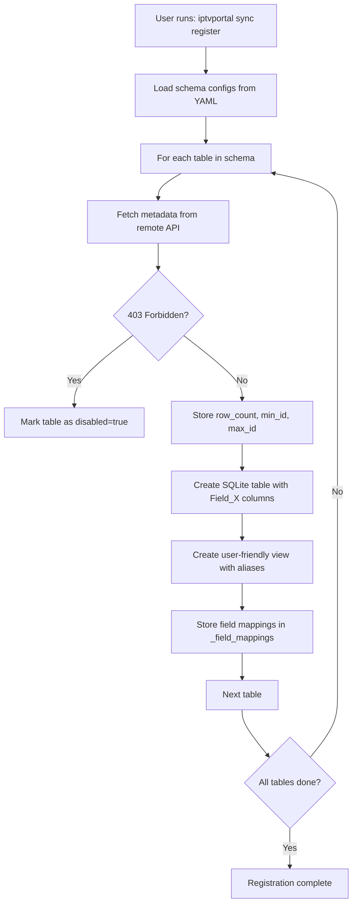
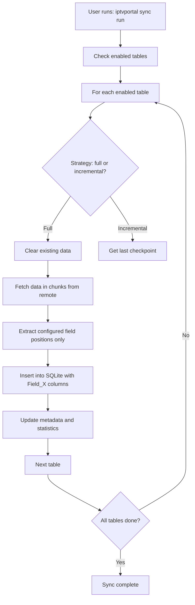
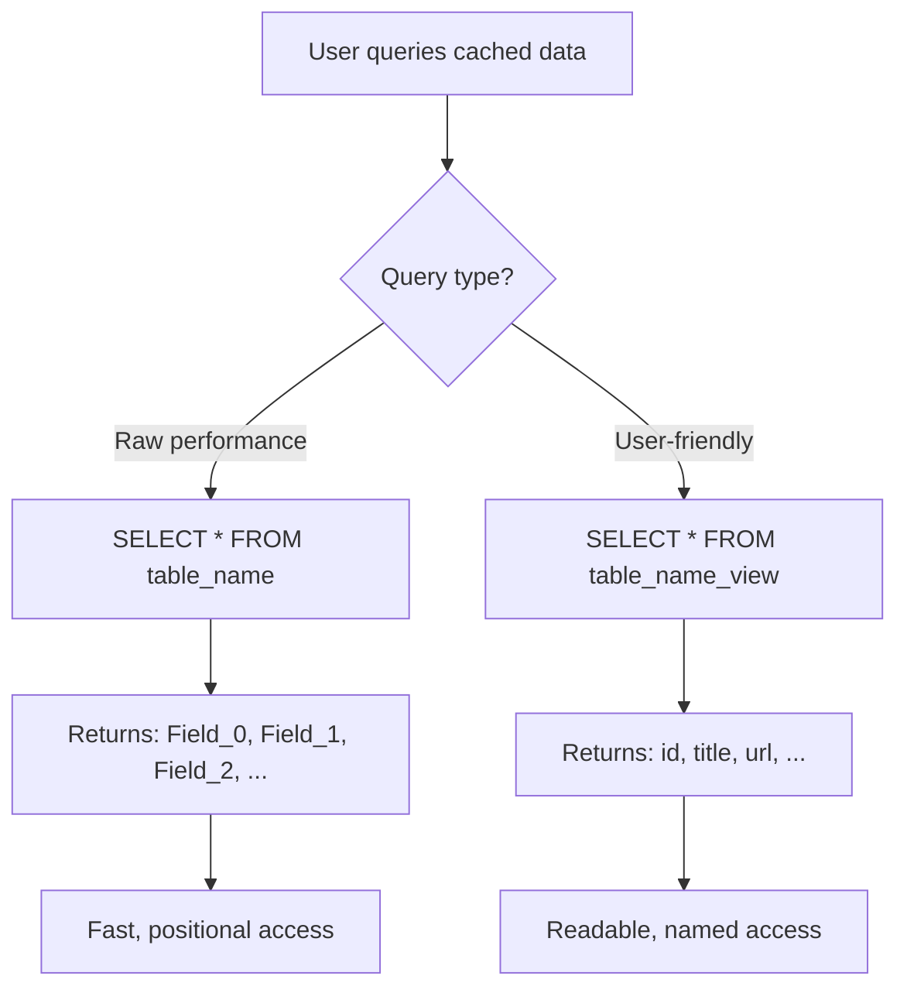

# IPTVPortal Sync System Workflow

## Overview

The IPTVPortal sync system provides complete data synchronization between remote IPTVPortal servers and local SQLite cache with intelligent schema handling and user-friendly data access.

## Core Workflow

### 1. Schema Registration Phase



**Key Points:**
- **Field_X Generation**: SQLite tables use auto-generated `Field_0`, `Field_1`, etc. for efficient storage
- **View Creation**: `{table_name}_view` provides user-friendly column names
- **403 Handling**: Tables with access denied are automatically disabled

### 2. Data Synchronization Phase



**Key Points:**
- **Full Data Extraction**: All remote fields captured, stored as Field_X columns
- **Selective Naming**: Configured fields use proper names, unknown fields use Field_X
- **Chunked Fetching**: Large tables synced in configurable chunks
- **Conflict Resolution**: REPLACE mode for full sync, UPSERT for incremental

### 3. Data Access Phase



## Detailed Field_X Mapping Workflow

### Schema Configuration
```yaml
# config/schemas.yaml
media:
  sync:
    strategy: full
    ttl: 3600
  fields:
    0: {name: id, type: integer}
    1: {name: title, type: string}
    2: {name: url, type: string}
    # Only 3 fields configured out of 74 remote fields
```

### Table Creation
```sql
-- SQLite table (efficient storage)
CREATE TABLE media (
    id INTEGER,
    title TEXT NULL,
    url TEXT NULL,
    _synced_at TEXT NOT NULL,
    _sync_version INTEGER DEFAULT 1,
    _is_partial BOOLEAN DEFAULT FALSE,
    PRIMARY KEY (id)
);

-- User view (friendly access)
CREATE VIEW media_view AS
SELECT
    id AS id,
    title AS title,
    url AS url,
    _synced_at,
    _sync_version,
    _is_partial
FROM media;
```

### Data Insertion Workflow

```
Remote API Response: [[1, "Movie", "http://...", extra1, extra2, ..., extra71]]
                     └─74 values total

Schema Config: positions [0,1,2] configured with remote_name mappings
               └─3 fields configured, but ALL fields extracted

Extraction: [1, "Movie", "http://...", extra1, extra2, ..., extra71]
            └─ALL 74 values extracted (no position filtering)

SQLite Insert: INSERT INTO media (id, title, url, Field_3, Field_4, ..., Field_73, ...)
               └─74 columns total, configured fields use proper names, others use Field_X
```

### Query Access Patterns

```sql
-- Raw table access (fast, internal)
SELECT Field_0, Field_1, Field_2 FROM media LIMIT 5;
-- Result: positional data for performance

-- User view access (friendly, external)
SELECT id, title, url FROM media_view LIMIT 5;
-- Result: named columns for readability

-- Mixed access (best of both)
SELECT id, title, url FROM media_view WHERE id > 1000;
-- User-friendly WHERE clause on readable view
```

## Error Handling Workflow

### Schema Mismatch (Expected Behavior)
```
Config: 15 fields → SQLite: 74 columns (Field_0 to Field_73)
Remote: 74 fields → API returns 74 values

Result: Extract ALL 74 values → Success ✅
Configured fields use proper names, unknown fields use Field_X → Complete data capture ✅
```

### 403 Forbidden (Automatic Handling)
```
Remote API: HTTP 403 Forbidden
System: Detect "403" in error message
Action: Set sync_config.disabled = True
Result: Table skipped in future syncs ✅
```

### Network/Connection Errors
```
Error: Connection timeout
Action: Retry with exponential backoff
Fallback: Mark sync as failed, update statistics
Recovery: Next sync attempt will retry
```

## Performance Optimizations

### 1. Chunked Synchronization
- Large tables split into 1000-row chunks by default
- Progress tracking and resumable operations
- Memory-efficient bulk inserts

### 2. Full Data Capture
- All remote fields extracted and stored locally
- Configured fields use proper names, unknown fields use Field_X
- Complete data preservation for future analysis
- No schema mismatch errors due to full extraction

### 3. Dual Access Patterns
- Raw tables for high-performance internal operations
- Views for user-friendly external queries
- No performance penalty for view usage

### 4. Intelligent Caching
- Metadata-driven staleness detection
- Configurable TTL per table
- Lazy loading for on-demand tables

## Configuration Examples

### Basic Table Sync
```yaml
media:
  sync:
    strategy: full
    ttl: 3600
    chunk_size: 1000
  fields:
    0: {name: id}
    1: {name: title}
    2: {name: url}
```

### Incremental Sync
```yaml
logs:
  sync:
    strategy: incremental
    incremental_field: timestamp
    ttl: 1800
  fields:
    0: {name: id}
    1: {name: timestamp}
    2: {name: level}
    3: {name: message}
```

### Disabled Table
```yaml
subscriber:
  sync:
    disabled: true  # Automatically set by 403 detection
  fields:
    0: {name: id}
    1: {name: name}
```

## CLI Commands Workflow

```bash
# Initialize sync database
iptvportal sync init

# Register tables and fetch metadata
iptvportal sync register

# Check sync status
iptvportal sync status

# Run synchronization
iptvportal sync run

# Clear cached data
iptvportal sync clear

# Query cached data
iptvportal sql "SELECT * FROM media_view LIMIT 5"
```

## Monitoring and Maintenance

### Statistics Tracking
- Per-table sync counts and durations
- Success/failure rates
- Data volume metrics
- Performance trends

### Automatic Maintenance
- Vacuum operations for space reclamation
- Analyze for query optimization
- Stale data cleanup
- Error recovery

### Health Checks
- Cache freshness validation
- Schema consistency verification
- Connection health monitoring
- Performance metric collection

This workflow ensures robust, efficient, and user-friendly data synchronization with comprehensive error handling and performance optimizations.
